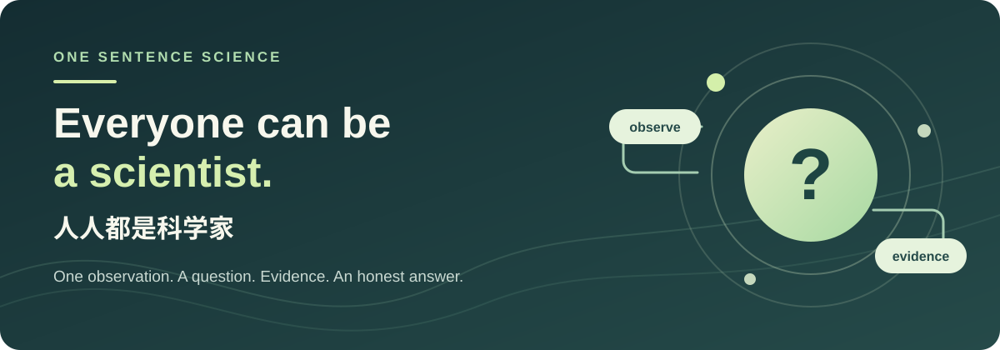
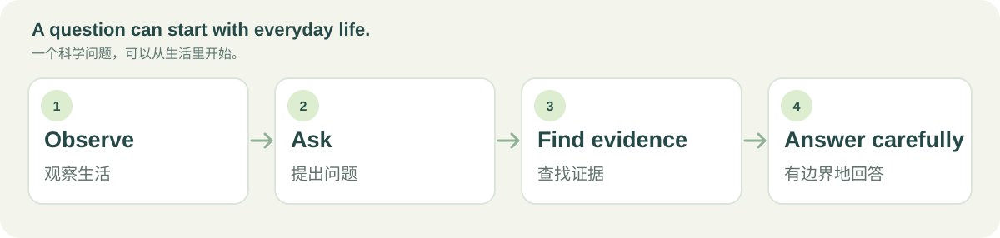

# OneSentenceScience



[English](#english) · [中文](#中文)

## English

### Everyone can be a scientist

**Start with one observation from everyday life. Move toward an answer grounded in evidence, with its limits made clear.**

> “I find it easier to open up to a friend while we are walking than when we sit down to talk.”

You do not need to know how to write a paper or use research jargon. Describe something you noticed, experienced, or wondered about in your own words. OneSentenceScience will try to:

1. Turn your observation into a clear research question.
2. Find relevant academic work through [OpenAlex](https://openalex.org/).
3. Distinguish initial support, mixed findings, and insufficient evidence.
4. Explain the tentative answer, alternative explanations, limitations, and links to the studies in plain language.



This is a working **v0.1 source-available prototype**. Its answers are preliminary summaries based on retrieved **paper abstracts**. It will not present a personal observation as a new discovery or invent a conclusion where evidence is missing.

### Quick start

You need Python 3.11+ and an internet connection for OpenAlex. The project has no third-party Python dependencies. Start the local app:

```powershell
python -m onesentencescience
```

Open `http://127.0.0.1:8765`. Select **OpenAI API**, enter your API key on the page, and start with a sentence. The default model is `gpt-4.1-mini`; you can change its name in “Interface and model settings.” An OpenAI API key with access to that model is required. You can also select **Custom compatible endpoint** for a `/v1/chat/completions` service, or **Local environment variables** for the previous setup method.

To keep chats on your computer, click **Choose chat folder** and select a folder. Each conversation becomes a JSON file there. Select the same folder next time, pick a conversation, and ask a follow-up; earlier turns help interpret the new question, while evidence is searched again. A browser with `showDirectoryPicker()` support uses its folder picker; otherwise, the local Python app opens a system folder dialog. If a dialog is unavailable, you can still import and download JSON files. The app never stores your API key in those files.

#### Local Ollama example

Install and start Ollama, then choose a model that understands both English and Chinese. On the page select **Custom compatible endpoint**; it pre-fills the local URL and model below, and the key can stay blank. You can also use environment variables:

```powershell
ollama pull qwen2.5:7b
$env:LLM_BASE_URL = "http://127.0.0.1:11434/v1"
$env:LLM_MODEL = "qwen2.5:7b"
python -m onesentencescience
```

#### Other compatible services

Use the page's custom endpoint fields, or keep using environment variables:

```powershell
$env:LLM_BASE_URL = "https://your-service.example/v1"
$env:LLM_MODEL = "your-model-name"
$env:LLM_API_KEY = "your-key"
python -m onesentencescience
```

You may also set `OPENALEX_API_KEY` to use your own OpenAlex allowance. Keep keys in local environment variables; do not commit them to GitHub. `.env.example` is only a configuration example: the app does not automatically load `.env`.

### What v0.1 does

The web page has one main observation input plus model and local history controls. The backend turns a sentence into a research question and English search terms, queries OpenAlex, and asks the model to answer using only the abstracts actually retrieved. Every evidence claim must point to a paper from that search; the app discards invented citations. The report keeps the question, search terms, and paper links so people can check them. A follow-up uses up to six earlier turns as conversational context, not as scientific evidence.

“Initial support” does not establish causation or mean the result applies to everyone. When the search is incomplete, abstracts lack detail, or studies disagree, the answer should say “insufficient evidence” or “mixed findings.”

### Roadmap

- **v0.1: One sentence → research literature → a qualified answer** (current)
- v0.2: Search public datasets and run basic, reproducible analyses
- v0.3: Explain ways to test a new hypothesis without assuming research training
- Later: Support public participation in research with appropriate safeguards

Publishing papers and user incentives are outside this first version. The long-term goal remains: **help anyone turn a question from daily life into a research question, then move toward a scientific conclusion through real evidence.**

### Privacy and boundaries

Your sentence and API key are sent from the page to the local server, which forwards them to the model service you chose. Generated English search terms are sent to OpenAlex. The app listens only on `127.0.0.1` and creates no account. A key entered on the page is not persisted by the app; conversations are written only to a folder you select, or downloaded when you choose to download them. Without a folder, chats last only until the page closes. Avoid entering other people's names, contact details, or sensitive information.

This version does not recruit research participants, deliver psychological interventions, or provide personal medical or legal judgments. A genuinely new question may need new data and a suitable study design; the app should say so.

### Development

```powershell
python -m unittest discover -s tests -v
```

Core code is in `onesentencescience/`; the interface is in `static/`. Issues and pull requests that make research more accessible and source checking stronger are welcome.

### License and commercial use

This revision is available under the [PolyForm Noncommercial License 1.0.0](LICENSE), with a [copyright notice](NOTICE). **Commercial use requires prior written permission from the repository owner.** Open a GitHub issue to discuss a commercial license. Because of this restriction, the project is **source-available, not OSI open source**.

Earlier commits were published under MIT. The new license applies to this revision; it does not retroactively withdraw rights already granted for earlier versions.

---

## 中文

### 人人都是科学家

**从一句生活观察出发，走向有证据、有边界的科学结论。**

> “我发现和朋友一起散步时，比坐下来聊天更容易谈起心事。”

你不需要先学会写论文，也不需要知道“变量”“研究设计”是什么意思。输入一句你亲眼看到、亲身经历或一直好奇的现象，OneSentenceScience 会尝试：

1. 用通俗中文梳理你真正想问的问题；
2. 在 [OpenAlex](https://openalex.org/) 检索相关学术研究；
3. 区分“有初步支持”“研究结果不一致”和“目前证据不足”；
4. 用简明语言给出初步结论、其他可能的解释、研究局限和论文链接。


这是一个真正可运行的 **v0.1 源码公开原型**。目前的回答主要依据检索到的**论文摘要**，属于初步证据综合。程序不会把用户的个人观察冒充为新发现，也不会在没有证据时编造结论。

### 快速开始

需要 Python 3.11+ 和用于检索 OpenAlex 的网络连接。项目本身没有第三方 Python 依赖。先启动本地程序：

```powershell
python -m onesentencescience
```

打开 `http://127.0.0.1:8765`，选择 **OpenAI API**，直接在网页输入 API 密钥，再写下一句观察即可开始。默认模型为 `gpt-4.1-mini`，可在“接口与模型设置”中修改模型名称；所填密钥需要有该模型的访问权限。你也可以选择**自定义兼容接口**，或继续使用**本机环境变量**。

若要把聊天记录留在自己的电脑上，点击**选择聊天文件夹**并选择一个目录。每段聊天会保存为一个 JSON 文件。下次重新选择同一文件夹，点开旧记录就能继续追问；旧对话帮助理解追问，新答案仍会重新检索证据。支持 `showDirectoryPicker()` 的浏览器会使用浏览器文件夹选择器；其他浏览器会由本地 Python 程序打开系统文件夹窗口。若系统窗口不可用，仍可导入和下载 JSON 文件。密钥绝不会写进聊天文件。

#### 使用本机 Ollama（示例）

先安装并启动 Ollama，准备一个支持中英文的模型。网页选择**自定义兼容接口**后，会预填下面的本机地址和模型名称，密钥可以留空。也可以继续用环境变量：

```powershell
ollama pull qwen2.5:7b
$env:LLM_BASE_URL = "http://127.0.0.1:11434/v1"
$env:LLM_MODEL = "qwen2.5:7b"
python -m onesentencescience
```

#### 使用其他兼容服务

可直接在网页填写兼容接口，也可继续使用环境变量：

```powershell
$env:LLM_BASE_URL = "https://你的服务地址/v1"
$env:LLM_MODEL = "你的模型名称"
$env:LLM_API_KEY = "你的密钥"
python -m onesentencescience
```

也可选填 `OPENALEX_API_KEY` 以使用自己的 OpenAlex 额度。密钥只放在本机环境变量，不要提交到 GitHub。`.env.example` 仅是配置示例，程序不会自动读取 `.env`。

### 第一个版本能做什么

网页有一个主要的观察输入框，以及模型设置和本地记录入口。输入一句话后，后端会将它转成研究问题和英文检索词，查询 OpenAlex，再让模型只依据实际返回的论文摘要作答。每条证据必须引用本次检索得到的论文；不存在的引用会被程序丢弃。最终报告会保留原始问题、检索词和论文链接，方便人检查。追问最多参考前六轮对话来理解上下文，不会把旧回答当作科学证据。

结果中的“有初步支持”不表示因果关系已经被证明，也不表示对每个人都适用。文献检索不完整、摘要信息不足或研究间存在差异时，系统应输出“证据不足”或“结果不一致”。

### 路线图

- **v0.1：一句话 → 文献证据 → 有边界的回答**（本仓库当前版本）
- v0.2：公开数据集检索与可复核的基础分析
- v0.3：针对新假设，生成普通人也能理解的验证方案
- 后续：在必要的保障下支持公众共同设计和参与研究

投稿、发表和激励机制暂不在当前版本范围内。长期目标仍然是：**让没有科研背景的人，也能从自己的生活出发提出科学问题，并在真实证据的帮助下走向科学结论。**

### 隐私与边界

输入的原句和密钥会先发送给本机服务，再由本机服务转发给你选定的模型服务；生成的英文检索词会发送给 OpenAlex。应用只监听本机 `127.0.0.1`，不建立账号，也不会持久保存你在页面输入的密钥。聊天记录只会写入你选择的文件夹，或在你主动下载时导出；未选择文件夹时，关闭页面后记录会消失。不要在输入中写入他人的姓名、联系方式或其他敏感信息。

当前版本不招募研究参与者、不开展心理干预，也不提供个人医疗或法律判断。想研究一个尚无资料回答的新问题，需要真实数据和相应的研究方法；系统会承认这个界限。

### 开发与测试

```powershell
python -m unittest discover -s tests -v
```

核心代码在 `onesentencescience/`，界面在 `static/`。欢迎提交能进一步降低普通人使用门槛、提高来源核验质量的 Issue 和 Pull Request。

### 许可证与商业使用

本版本采用 [PolyForm Noncommercial License 1.0.0](LICENSE)，并附有[版权声明](NOTICE)。**商业使用须事先获得仓库所有者的书面许可。**如需商业授权，请通过 GitHub Issue 联系。由于包含非商业限制，本项目是**源码公开项目，而非符合 OSI 定义的开源项目**。

此前的提交曾以 MIT 许可发布。新许可适用于本版本，不会追溯撤销此前版本已授予的使用权。
